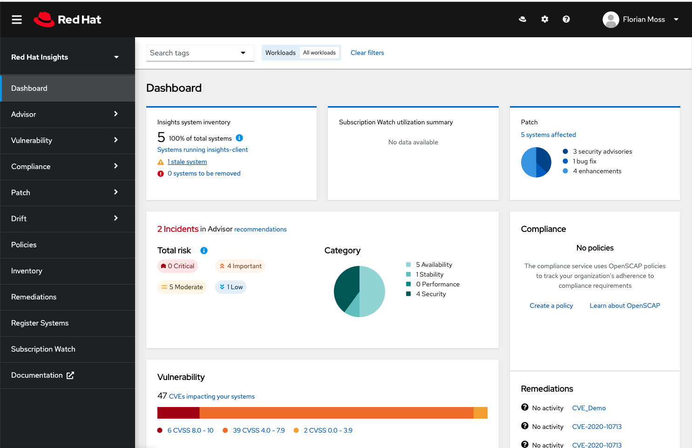
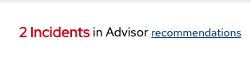
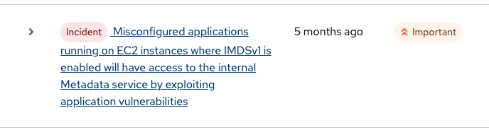
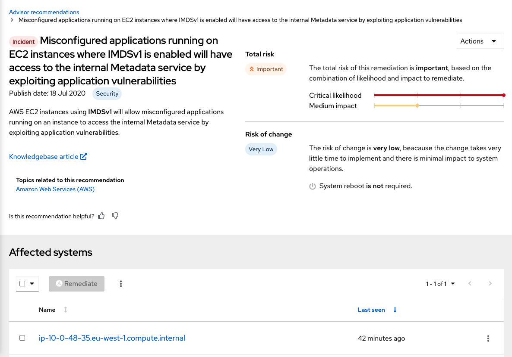
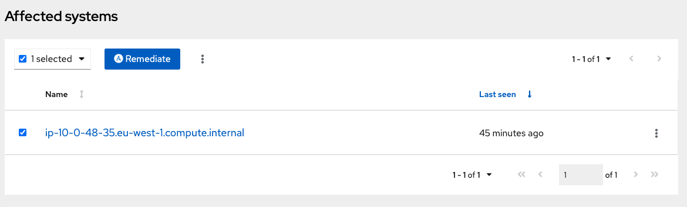
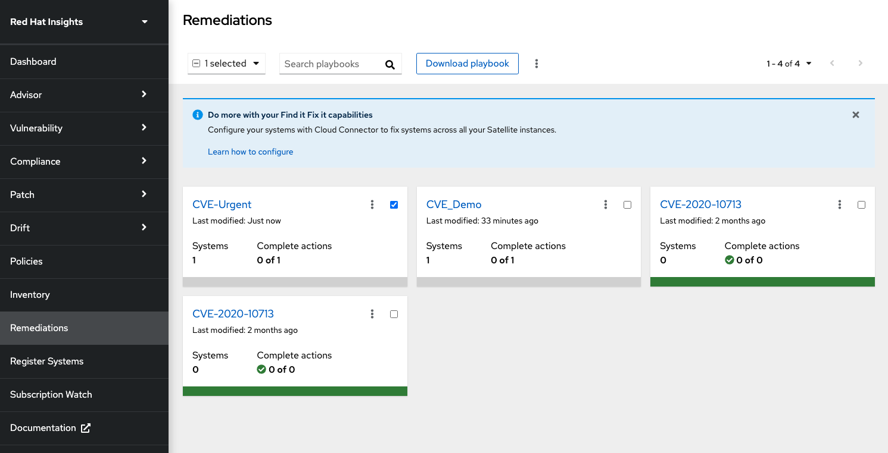

# AWS: Red Hat Insights Demo

This repository does a couple of things:

1. Setting up a 4 host environment in AWS with Terraform (1 Ansible Tower node (RHEL8_x86) and 3 hosts - RHEL8_x86, RHEL8_ARM and RHEl7.6_x86).

2. Configure the Ansible Tower instance with Ansible.

3. Register the deployed hosts with Red Hat Insights.

4. Outline steps to patch the hosts.

## Step 1: Setting up the environment

**Prerequisites**

- [Installation of Terraform](https://learn.hashicorp.com/tutorials/terraform/install-cli), (tested with v0.14)

```bash
    # For MacOS
    brew install terraform

    # Verify Installation
    terraform --version
```
- [AWS CLI Installation](https://docs.aws.amazon.com/cli/latest/userguide/install-cliv2.html)

```bash
    # For MacOS
    curl "https://awscli.amazonaws.com/AWSCLIV2.pkg" -o "AWSCLIV2.pkg"
    sudo installer -pkg AWSCLIV2.pkg -target /

    # Verify Installation
    which aws
    aws --version
```
- [AWS CLI: Configuration with Access Key and Secret](https://docs.aws.amazon.com/cli/latest/userguide/cli-configure-quickstart.html#cli-configure-quickstart-creds), or any other form of authentication to run Terraform

```bash
    # Configure AWS - create Access Key/Secret first
    aws configure
```
- [AWS Key Pair named: insights-Demo](https://docs.aws.amazon.com/AWSEC2/latest/UserGuide/ec2-key-pairs.html)

```bash
    # Create Key - no keyphrase
    ssh-keygen -t rsa -C "insights-demo" -f ~/.ssh/insights-demo
    cp -f ~/.ssh/insights-demo /tower-api/files/insights-demo.pem

    # Configure AWS - create Access Key/Secret first
    aws ec2 import-key-pair --key-name "insights-demo" --public-key-material fileb://~/.ssh/insights-demo.pub
```


**Deploying the Infrastructure**
- Open the directory that contains this repository
```bash
    cd insights-demo
    terraform init
    # Deploy the Infrastructure
    terraform apply

    # Destroy the Infrastructure
    terraform destroy
```

Once the `terraform apply` command finishes, you will see the file `inventory` newly created in your directory. This is the inventory file that will be used to configure `Ansible Tower` initially.


## Step 2: Configure Ansible Tower with Ansible

**Prerequsites**
- Local [Ansible installation](https://docs.ansible.com/ansible/latest/installation_guide/intro_installation.html)

**Configure the Host to run Ansible Tower**
```bash
cd tower-installation
# Install Ansible Tower in AWS
ansible-playbook -i ../inventory configure_tower.yml
```

The AWS infrastructure might take 1-2 minutes to initialize initially. Make sure to run the `configure_tower.yml` playbook a few minutes after the `terraform apply` command has finished. The playbook as it is will install `Ansible Tower 3.8`. Don't worry if the task `Run the Tower installer` takes a little bit longer. This task can take up to 30 min to complete.

- Log into the Ansible Tower debployment (username: `admin`, password: `password`). 
- Enter your RHN Credentials and Continue.

## Step 3: Register the deployed hosts with Insights
Ansible Tower is build around a comprehensive REST API, we can use this to our advantage and create `Credentials`, `Projects` and `Templates` by using the AWX collection.

```bash
# Create the AWS inventory, project, credentials and template
# You will need your AWS Access/Secret Key Pair here
cd tower-api
ansible-playbook -i ../inventory setup.yml
> What is your AWS Access Key ID?: ____
> What is your AWS Secret Key?: ____
> What is your Red Hat Portal Username?: ____
> What is your Red Hat Portal Password?: ____
```

This playbook does a couple of things:
- Adds a new Ansible Tower Project
- Creates an AWS Credential
- Adds the AWS Inventory
- Creates a custom Credential and generates an entry
- Adds AWS SSH Key
- Creates Tower job template

**Log into Ansible Tower and trigger the template manually**

## 4. Patching a Host with Insights

First go to [Red Hat Insights](https://cloud.redhat.com/insights/dashboard) and confirm that all hosts were loaded into the Dashboard.

The Dashboard should look similar to:


Naturally, everything that is blinking `red` is not good. So, we go ahead and select `recommendations`, next to `2 Incidents`.



The `Advisor Recommendations` take all of our support cases into consideration and make recommendations based on all RHEL users out there. The bottom incident looks dangerous, we want to immediately fix this.



The next Window tells us even more about the issue:
> AWS EC2 instances using IMDSv1 will allow misconfigured applications running on an instance to access the internal Metadata service by exploiting application vulnerabilities.

We are also getting 2 very important infos:
1. Based on likelihood of the bug and impact, a total risk factor is calculated.
2. Based on our experience with other customer, we can make a prediction how likely a patch is gonna impact your uptime.



Last but not least, we can see which systems are affected. Luckily, this bug only affects a single system. We can select the system in question and `Remediate` the issue by downloading an Ansible playbook.



We can fill out the required information in the pop up windows. For this example, we use the name `CVE-Urgent`. Once we are done, we can select the `Remediations` sections and download our compiled playbook.



We have now a number of options:
- Run the playbook directly 
- Compile further remediation playbooks
- or running the playbook through Ansible Tower.